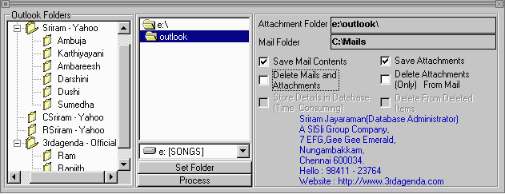



## Attachment Ripper \- Outlook

### Description

Outlook Attachment Ripper:

This utility will allow you to extract the mails and the attachment from the Outlook folders. This will work even if your outlook has multiple and recursive folders.

This Utility can:

1.	Extract Email.

2.	Extract Attachment.

3.	Delete Attachments.

4.	Delete mails and attachments.

5.	Set the target directory.

6.	Specify the Source Folder (Outlook).

Please VOTE, if you feel its useful to PSC....

thanks
 
### More Info
 
Just add outlook 9.0 object library

and microsoft VBSCript Regular Expressions.

step : click on project/ preferences....

             |
---                |---
**Submitted On**   |2002-02-07 11:57:32
**By**             |[Sriram Jayaraman](https://github.com/Planet-Source-Code/PSCIndex/blob/master/ByAuthor/sriram-jayaraman.md)
**Level**          |Intermediate
**User Rating**    |4.6 (124 globes from 27 users)
**Compatibility**  |VB 6\.0
**Category**       |[Microsoft Office Apps/VBA](https://github.com/Planet-Source-Code/PSCIndex/blob/master/ByCategory/microsoft-office-apps-vba__1-42.md)
**World**          |[Visual Basic](https://github.com/Planet-Source-Code/PSCIndex/blob/master/ByWorld/visual-basic.md)
**Archive File**   |[Outlook\_at69638472002\.zip](https://github.com/Planet-Source-Code/sriram-jayaraman-attachment-ripper-outlook__1-33553/archive/master.zip)

